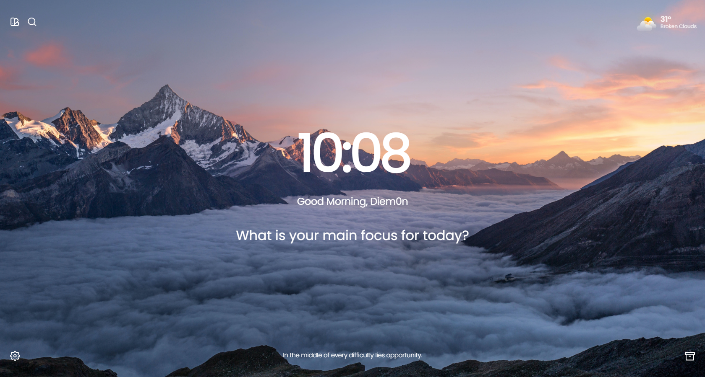

 

## 🍀 Aura

Aura is a simple and elegant momentum clone built with React, designed to help you stay focused and organized throughout your day. With Aura, you can set daily goals, track your tasks, and maintain a sense of productivity and motivation.
All while enjoying the added advantage of accessing all the premium features of Momentum for free.

## 🧙🏼‍♂️ Features

`🌌 Chronicles of Versions:` Witness the evolution of Aura's magic with each enchanting version.

`🔮 Customization Spell:` Weave your own design enchantment with customizable elements and settings, aligning Aura with your essence.

`✨ Affirmation Charms:` Immerse yourself in motivational mantras that empower your day and illuminate your path.

`📚 Sorcery of Knowledge:` Harness the search bar's magic to summon information from various realms of the internet.

`📝 Task Enchantment:` Embark on a quest of productivity with the to-do feature, your loyal companion.

`💖 Favored Elements:` Keep your cherished features close, favored with a touch of magical allure.

`🌅 Wisdom Scrolls:`Engage with custom quotes that stir wisdom and reflection in your magical journey.

## 📸 In Action



<!-- 

`Yeah we don't have those snapshots yet`  -->

## ⚙️ Project Setup

### 📦 Prerequisites

To run this project, you will need to have the following on your machine:

- openweather current weather api key (optional feature can be turned off)
- yarn or npm

### 🚀 Quick start

1. **Clone the repository**

    ```js
    git clone https://github.com/Diem0n/aura
    ```

1. **Install the dependencies with yarn or npm**

    ```js
    yarn
    ```

    ```js
    npm
    ```

1. **Start developing**

    Run the development server.

    ```js
    yarn dev 
    ```

    ```js
    npm dev 
    ```


## 📜 Version Chronicles

Explore the magical progression of Aura's versions:

`v1.0 - The Awakening:` The dawn of Aura's magic, laying the groundwork for its journey.

`v2.0 - The Evolution:` Enhanced components and layout, enhancing the user's magical experience.

`v3.0 - The Ascension:` Transcend to new heights as Aura unlocks premium features, invoking inspiration.

View the compelete [🌌 Chronicals](./CHANGELOG.md) details

## ✨ Contribution

Be a part of Aura's enchanting growth [View Contribution Guide](./CONTRIBUTION.MD). Forge your own magical path by forking the repository, casting your spells, and opening a pull request. Together, we'll elevate Aura's charm.

