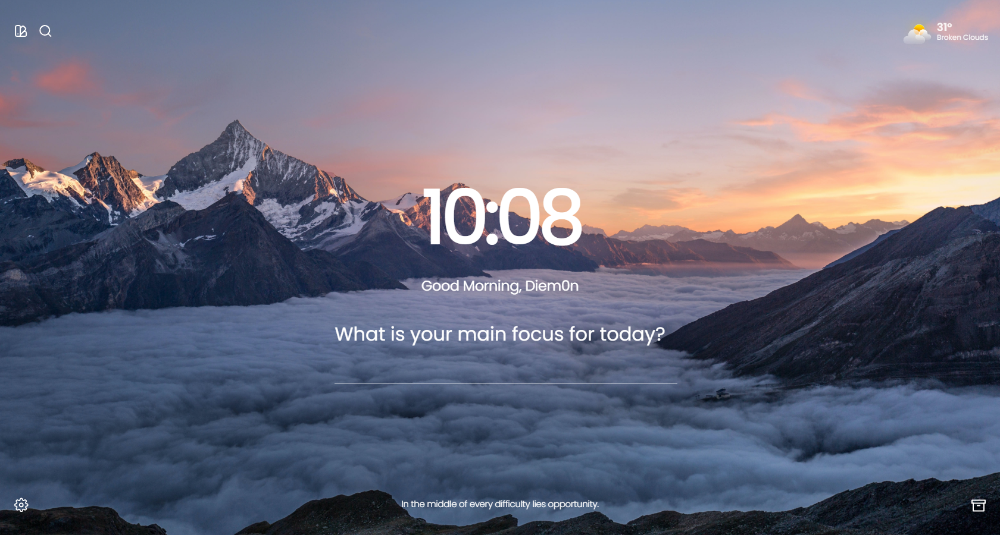

 

## 🍀 Aura

Presenting Aura, a React-based rendition inspired by Momentum. Created to provide simplicity and elegance, Aura enhances focus and organization in your daily life. From managing daily goals to tracking tasks, Aura ensures your productivity journey while offering the premium features of Momentum, free of charge.

## 🧙🏼‍♂️ Features

`🌌 Version History:` Explore Aura's evolution through different versions.

`🎨 Customization:` Personalize Aura's appearance to match your style.

`✨ Affirmations:` Access motivational mantras to uplift your day.

`🔍 Search Bar:` Utilize the search bar to find information online.

`📝 To-Do List:` Manage tasks efficiently with the integrated to-do feature.

`💖 Favorite Features:` Pin your preferred functionalities for easy access.

`📚 Quotes:` Engage with insightful quotes for reflection.

## 📸 In Action



<!-- 

`Yeah we don't have those snapshots yet`  -->

## ⚙️ Project Setup

### 📦 Prerequisites

To run this project, you will need to have the following on your machine:

- openweather current weather api key (optional feature can be turned off)
- yarn or npm

### 🚀 Quick start

1. **Clone the repository**

    ```js
    git clone https://github.com/Diem0n/aura
    ```

1. **Install the dependencies with yarn or npm**

    ```js
    yarn
    ```

    ```js
    npm
    ```

1. **Start developing**

    Run the development server.

    ```js
    yarn dev 
    ```

    ```js
    npm dev 
    ```

## 📜 Version History

Explore the different stages of Aura's development:

`v1.0 - The Awakening:` Initial launch, setting the foundation.

`v2.0 - The Evolution:`Enhanced components and layouts for improved user experience.

`v3.0 - The Ascension:` Premium features introduced, inspiring further growth.

For complete details, refer to the [🌌 Version History.](./docs/CHANGELOG.md)

## ✨ Contribution

Join us in Aura's journey by contributing. Find guidelines in the [Contribution Guide](./docs/CONTRIBUTION.MD). Fork the repository, make your enhancements, and create a pull request to help Aura flourish.
